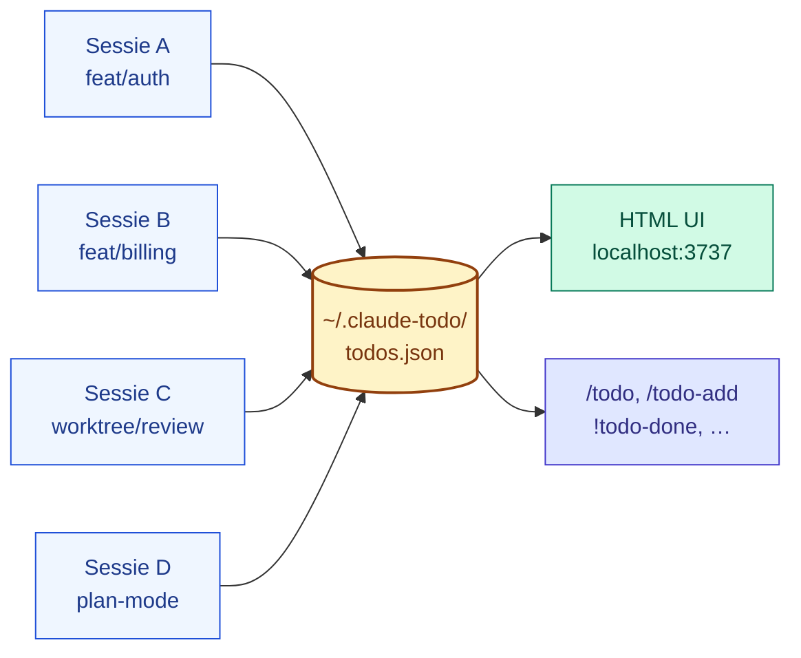
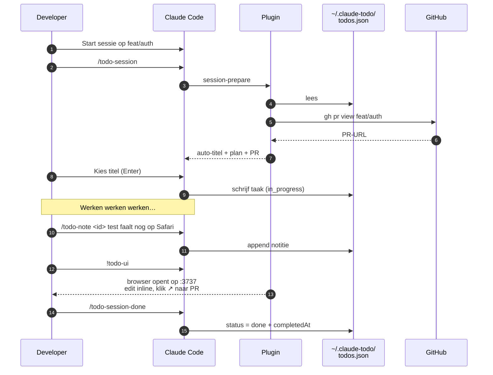
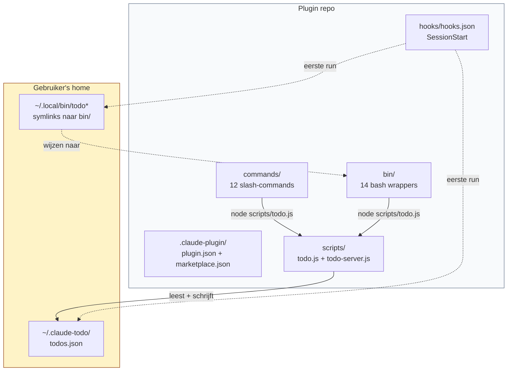

# todo

> **Eén to-do lijst voor al je Claude Code sessies. Persistent, lokaal, zonder cloud.**

Voor developers die meerdere sessies parallel draaien — per branch, per feature, per worktree — en die versplinterd werk willen centraliseren zonder Linear, Jira of Notion te openen.

---

## Het probleem

Als je serieus met Claude Code werkt heb je al snel **meerdere sessies tegelijk** open:

- Eén sessie refactort de auth module
- Een andere debugt een flaky test op `feat/billing-v2`
- Een derde staat in een worktree te wachten op review-feedback
- En in een vierde zit je vandaag's plan-document

De ingebouwde `TodoWrite` tool van Claude verdwijnt zodra je `/clear` doet of de sessie sluit. Je **eigen** todo's — "dit moet ik morgen nog testen", "vergeet niet PR #1234 te reviewen" — leven dan op post-its, in een markdown ergens, of in je hoofd.

Resultaat: je start maandag een sessie, ziet lege context, en vraagt je af waar je vrijdag was gebleven in die ándere sessie.

## De oplossing

Eén globale to-do lijst (`~/.claude-todo/todos.json`) die elke sessie deelt. Taken worden automatisch getagd met de branch, het plan-bestand en de PR waarin ze zijn ontstaan — zodat je later precies weet waar iets bij hoorde.



## Simpel en licht

Geen database, geen auth, geen cloud, geen dependencies. Eén JSON-bestand en twee Node-scripts.

| Wat | Waarom licht |
|---|---|
| **Data** | Plain JSON op disk — `jq` en `cat` werken out of the box |
| **CLI** | Pure Node.js, geen `node_modules` |
| **Server** | Inline HTML + `http` module — 0 npm packages |
| **UI** | Vanilla JS + `contenteditable` — geen React, geen build step |
| **Distributie** | Claude Code plugin via GitHub, één `/plugin install` |

Totale codebase: **~1500 regels**. Bootet in milliseconden. Geen background processes.

## Installatie

```
/plugin marketplace add Michieldejongh/todo-plugin
/plugin install todo@todo-marketplace
```

Herstart je sessie. Klaar.

De `SessionStart` hook maakt bij eerste run `~/.claude-todo/todos.json` aan en symlinkt de shell-wrappers naar `~/.local/bin/` (als die op je `PATH` staat). Volledig idempotent — volgende sessies doen niks.

## Een typische flow



## Commands

Tab na `/todo` in Claude Code opent een picker met alle varianten.

| Command | Shortcut (bash `!`) | Doet |
|---|---|---|
| `/todo` | `!todo` | Interactief overzicht + actie-keuze |
| `/todo-add <titel>` | `!todo-add <titel>` | Nieuwe taak (auto branch/plan/PR) |
| `/todo-start <id>` | `!todo-start <id>` | Op "bezig" zetten |
| `/todo-done <id>` | `!todo-done <id>` | Afronden |
| `/todo-note <id> [tekst]` | `!todo-note <id> …` | Notitie toevoegen |
| `/todo-edit <id> <titel>` | `!todo-edit <id> …` | Titel aanpassen |
| `/todo-due <id> <YYYY-MM-DD>` | `!todo-due <id> …` | Deadline (of `clear`) |
| `/todo-rm <id>` | `!todo-rm <id>` | Verwijderen (bevestigt bij actief) |
| `/todo-session` | `!todo-session` | Huidige Claude-sessie als taak |
| `/todo-session-done` | `!todo-session-done` | Sessie-taak afronden |
| `/todo-ids` | `!todo-ids` | Compacte ID-lijst (kopieerhulp) |
| `/todo-ui` | `!todo-ui` | HTML frontend op http://localhost:3737 |

ID-matching: prefix of 5-char suffix volstaat. `t_2026` werkt als het uniek is, anders zie je kandidaten.

## Wat je krijgt

**Automatisch gekoppeld aan je werk:**

- `gitBranch` — automatisch uit `git branch --show-current`
- `planSlug` — recent gewijzigd `~/.claude/plans/*.md` wordt gedetecteerd
- `prUrl` — `gh pr view <branch>` wordt silent aangeroepen
- `sessionId` + `sessionTitle` — via de huidige `~/.claude/projects/` transcript

**HTML UI (`/todo-ui`):**

- Drie kolommen: Open / Bezig / Afgerond (laatste 7 dagen)
- Alle velden inline bewerkbaar via `contenteditable`
- HTML5 date-picker voor deadlines (rood = overdue, geel = binnen 2 dagen)
- Klikbare `↗` naar PR en `↗` naar plan-bestand
- Auto-refresh elke 10 seconden — synchroon met Claude muteaties

## Architectuur



**Data overleeft plugin-updates** omdat het buiten de plugin-cache woont. De plugin zelf bevat alleen code; jouw taken blijven in `~/.claude-todo/`.

## Data-formaat

```json
{
  "id": "t_20260508_143012_a72e2",
  "title": "PvA lifecycle test fixen",
  "status": "in_progress",
  "createdAt": "2026-05-08T14:30:12Z",
  "startedAt": "2026-05-08T15:01:00Z",
  "completedAt": null,
  "sessionId": "d3d8c22b-1e74-4388-aec2-5de694531cb4",
  "sessionTitle": "PvA e2e test opnieuw stabiliseren",
  "gitBranch": "feat/plan-van-aanpak-toezichtsmodule",
  "cwd": "/Users/michiel/Documents/GitHub/basisbeeld",
  "planSlug": "pva-lifecycle-refactor",
  "prUrl": "https://github.com/basisbeeld/app/pull/1793",
  "dueDate": "2026-05-15",
  "notes": [
    { "timestamp": "2026-05-08T15:30:00Z", "text": "journaalModal selector aanpassen" }
  ]
}
```

`jq` speelt dus gewoon mee. Geen migraties, geen schema's.

## Voor power-users

- **Custom data-locatie** — zet `TODO_DATA_FILE=/path/to/todos.json` (voor iCloud, Dropbox, team share)
- **Direct script-gebruik** — `node ~/.claude/plugins/cache/**/todo-marketplace/todo/*/scripts/todo.js help`
- **Machine-readable output** — `menu-data` en `session-prepare` geven JSON terug voor eigen integraties

## Migreren vanaf een oudere hand-installatie

Als je eerder losse bestanden had in `~/.claude/commands/todo*.md`:

```bash
bash ~/.claude/plugins/cache/*/todo-marketplace/todo/*/migrate.sh
```

Verplaatst bestaande data, ruimt oude bestanden op, en herstart-hook herinstalleert de symlinks.

## Licentie

MIT © Michiel de Jongh
